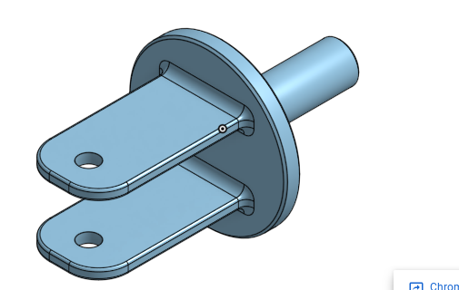

# BasicCAD

We are creating a caster.

---
## Table of Contents
* [Table of Contents](#Table-of-Contents)
* [Base](#Base)
* [Mount](#Mount)
* [Fork](#Fork)
* [Tire](#Tire)
* [Wheel](#Wheel)
* [AxleCollarBearings](#AxleCollarBearings)

## Base

### Description

The first assignment is to create the caster base.  The base's dimensions are 200 mm x 120 mm and 8 mm thick.  It has 6 holes 10 mm wide and 20 mm from the edge equally spaced along the edges.

### Evidence
[The Base in Onshape](https://cvilleschools.onshape.com/documents/0d70f655203ca304cb3c5b7d/w/f55603f962f6fc74f5548a68/e/41d730c570a8d75fce9f51b6)

### Image

### Reflection

This was my first Onshape part and [following along with Dr. Shields made it super easy.](https://www.youtube.com/watch?v=93BFUD-HAG8&feature=emb_title&scrlybrkr=5670f0b4)  I learned about 
* sketching (shortcut **shift-s**)
* constructions lines (shortcut **Q**)
* dimensions (shortcut **D**)
* extruding both add and remove (shortcut key **E**)
* linear patterns (no shortcut)

Onshape is awesome.  I found it really helpful to rename all my sketches.  It is going to be a GREAT year in engineering.

---

## Mount

### Description

this is the mount

### Evidence

https://cvilleschools.onshape.com/documents/59f726553781fdb576a99479/w/4eb8ef69e4469b2638b2b78e/e/3be90aea39aa472555d8c469

### Image

### Reflection

Mr dierdolf helped me make this. I learned the use tool.

---

## Fork

### Description

fork for the caster

### Evidence

[fork](https://cvilleschools.onshape.com/documents/59f726553781fdb576a99479/w/4eb8ef69e4469b2638b2b78e/e/3be90aea39aa472555d8c469)

### Image

### Reflection

Mr dierolf helped me with this. It was fun to do. Im learning more and more, everytime I do this.

---

## Tire

### Description
The objective of this assignment was to teach us the complexity of dimensions and how to apply them to in Onshape.

### Evidence
https://cvilleschools.onshape.com/documents/425649af837a029dad528875/w/ba72b80e208b8a4df604ff32/e/20042854d4fac4ae9b74e665

### Image

### Reflection

---

## Wheel

### Description

### Evidence

### Image

### Reflection

---

## AxleCollarBearings

### Description

### Evidence

### Image

### Reflection

